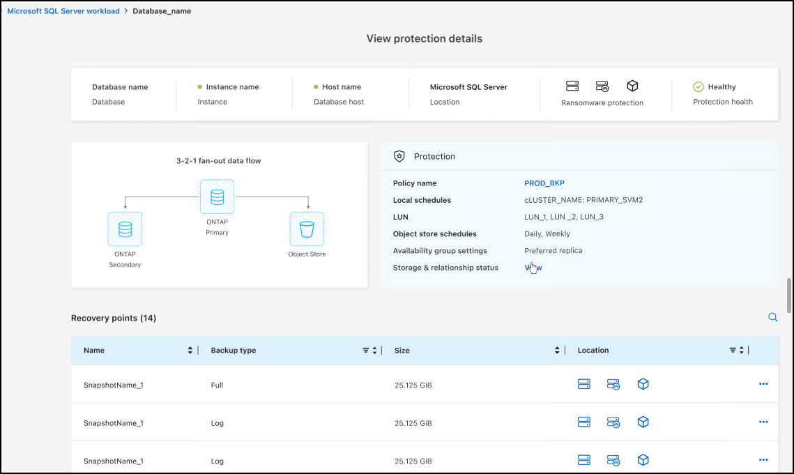

=== Microsoft SQL Server workload supported in General Availability (GA)

Microsoft SQL Server workload support is now generally available (GA) in NetApp Backup and Recovery. Organizations using an MSSQL environment on ONTAP, Cloud Volumes ONTAP, and Amazon FSx for NetApp ONTAP storage can now take advantage of this new backup and recovery service to protect their data. 

This release includes the following enhancements to the Microsoft SQL Server workload support from the previous preview version: 

* *SnapMirror active sync*: This version now supports SnapMirror active sync (also referred to as SnapMirror Business Continuity [SM-BC]), which enables business services to continue operating even through a complete site failure, supporting applications to fail over transparently using a secondary copy. NetApp Backup and Recovery now supports protection of Microsoft SQL Server databases in a SnapMirror active sync and Metrocluster configuration. The information appears in the *Storage and relationship status* section of the Protection details page. The relationship information is displayed in the updated *Secondary settings* section of the Policy page.
+
//See link:br-use-policies-create.html[Use policies to protect your workloads] for more information about policies.
Refer to https://docs.netapp.com/us-en/data-services-backup-recovery/br-use-policies-create.html[Use policies to protect your workloads].
+

* *Multi-bucket support*: You can now protect the volumes within a working environment with up to 6 buckets per working environment across different cloud providers.
* *Licensing and free trial updates* for SQL Server workloads: You can now use the existing NetApp Backup and Recovery licensing model to protect SQL Server workloads. There is no separate licensing requirement for SQL Server workloads.
+ 
//See link:br-start-licensing.html[Set up licensing for NetApp Backup and Recovery] for more information about licensing.
For details, refer to https://docs.netapp.com/us-en/data-services-backup-recovery/br-start-licensing.html[Set up licensing for NetApp Backup and Recovery].

* *Custom snapshot name*: You can now use your own snapshot name in a policy that governs the backups for Microsoft SQL Server workloads. Enter this information in the *Advanced settings* section of the Policy page. 
+
image:../media/screen-br-sql-policy-create-advanced-snapmirror.png[SnapMirror and snapshot format settings screenshot for NetApp Backup and Recovery policies]   
+
Refer to https://docs.netapp.com/us-en/data-services-backup-recovery/br-use-policies-create.html[Use policies to protect your workloads].

* *Secondary volume prefix and suffix*: You can enter a custom prefix and suffix in the *Advanced settings* section of the Policy page.
* *Identity and access*: You can now control users' access to features. 
+
//For details, see link:br-start-login.html[Log in to NetApp Backup and Recovery] and link:reference-roles.html[NetApp Backup and Recovery access to features].
Refer to https://docs.netapp.com/us-en/data-services-backup-recovery/br-start-login.html[Log in to NetApp Backup and Recovery] and https://docs.netapp.com/us-en/data-services-backup-recovery/reference-roles.html[NetApp Backup and Recovery access to features].

* *Restore from object storage to an alternate host*: You can now restore from object storage to an alternate host even if the primary storage is down.
* *Log backup data*: The database protection details page now shows log backups. You can see the Backup type column that shows whether the backup is a full backup or a log backup. 
* *Enhanced Dashboard*: The Dashboard now shows Storage and Clone savings.
+
image:../media/screen-br-dashboard3.png[NetApp Backup and Recovery Dashboard]

=== ONTAP volume workload enhancements

* *Multi-folder restore for ONTAP volumes*: Until now, you could restore either one folder or multiple files at a time from the Browse and restore feature. NetApp Backup and Recovery now provides the ability to select multiple folders at a time using the Browse and restore feature.

* *View and manage backups of deleted volumes*: The NetApp Backup and Recovery Dashboard now gives an option to show and manage volumes that are deleted from ONTAP. With this, you can view and delete backups from volumes that no longer exist in ONTAP.

* *Force delete backups*: In some extreme cases, you might want NetApp Backup and Recovery not to have access to backups any longer. This might happen for example, if the service no longer has access to the backup bucket or backups are DataLock protected but you don't want them anymore. Previously, you could not delete these yourself and needed to call NetApp Support. With this release, you can use the option to force delete backups (at volume and work environment levels).

CAUTION: Use this option carefully and only in extreme cleanup needs. NetApp Backup and Recovery will not have access to these backups any longer even if they are not deleted in the object storage. You will need to go to your cloud provider and manually delete the backups.

//For details, see link:prev-ontap-protect-overview.html[Protect ONTAP workloads].
Refer to https://docs.netapp.com/us-en/data-services-backup-recovery/prev-ontap-protect-overview.html[Protect ONTAP workloads]. 

